

    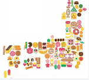

# &nbsp;&nbsp;&nbsp;&nbsp;&nbsp;&nbsp;&nbsp;&nbsp;&nbsp;&nbsp;&nbsp;&nbsp;&nbsp;&nbsp;&nbsp;&nbsp;&nbsp;&nbsp;&nbsp;&nbsp;&nbsp;&nbsp;&nbsp;&nbsp;&nbsp;&nbsp;&nbsp;&nbsp;&nbsp;&nbsp;&nbsp;&nbsp;Find Japanese regional sweets!

## 制作背景
現在、訪日外国人観光客は少ないが、コロナ禍以前は3188万人以上と非常に多かったので、今後再び増加していくと考えられる。この強い需要に対して、より楽しく充実した観光をしてほしいと思い、観光に欠かせないお土産（ご当地お菓子）に関するサービスを作りたいと思った。

お菓子を選んだ理由は、観光庁の訪日外国人の消費動向調査（2019年）から、観光・レジャー目的で訪日した際の、菓子類の購入率は73.45％で費目別で最も高かったからである。また、最も満足した購入商品は菓子類で、全体の21.5％だった。

加えて、外国人向けのサイトで、お土産としてのお菓子をランキング形式で紹介しているサイトは散見されるが、「ご当地お菓子」を紹介しているサイトはほぼなかったので制作しようと考えた。

## 概要
「Find Japanese regional sweets!(日本のご当地お菓子を見つけよう!)」

本アプリは以下に示すポイントに根差して設計されています。

・お菓子投稿機能 
・お菓子に対するコメント機能  
・いいね機能  
・いいね数に応じたランキング機能  

「日本のお菓子で幸せに」をコンセプトとしています。

アプリへGo！⇒ https://find-japanese-sweets.herokuapp.com/

## 開発環境
### 使用言語：
PHP  
HTML  
CSS  

### 環境:
Laravel(ver.9)  
AWS(EC2＋Cloud9)  
MySQL(MariaDB)  
Github  

### デプロイ：
Heroku

## データ構成
### ER図：

### 各テーブル詳細:
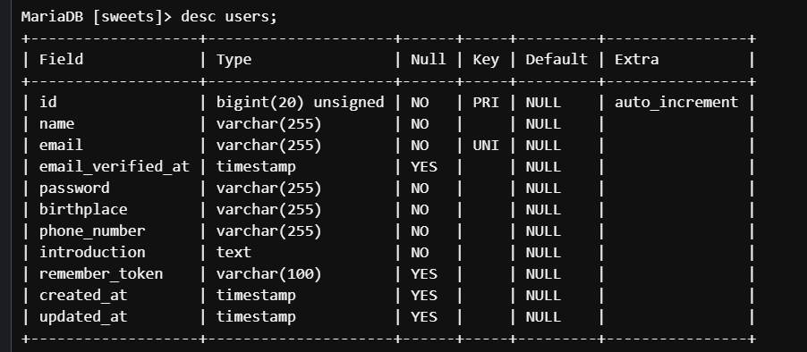
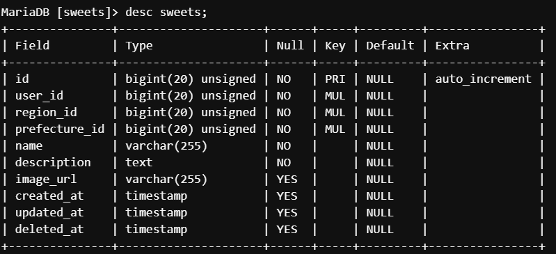
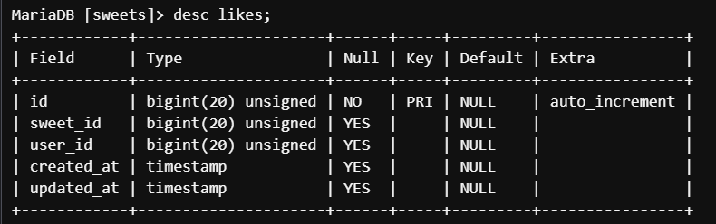
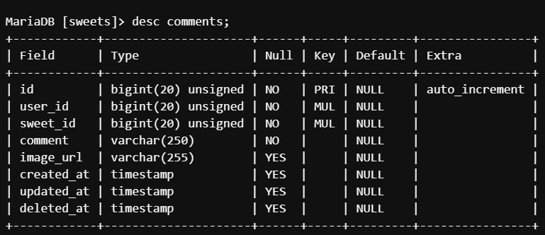
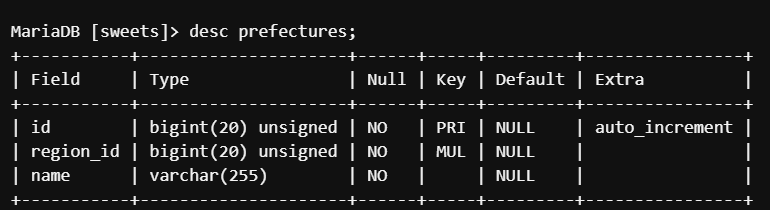
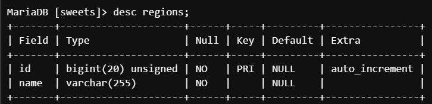

## 機能
・CRUD  
・ログイン  
・画像アップロード＆表示（Cloudinary）  
・いいね  
・コメント  

## こだわり

### いいね数に応じたランキング機能：
それぞれのお菓子の投稿に対して各ユーザーが「いいね」をすることができ、Home画面には「いいね」が多い順に投稿が表示されます。
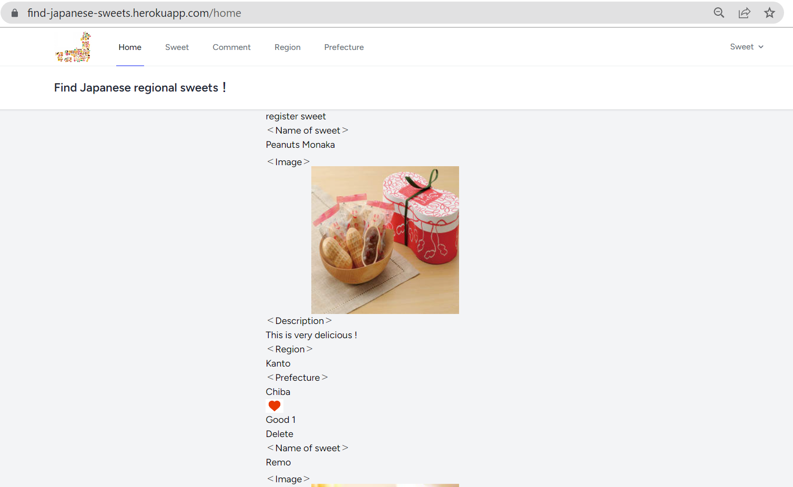

### 地域・都道府県ごとのお菓子表示機能：
ヘッダーの「Region」「Prefecture」を選択すると、それぞれ地域名や都道府県名が並んだページにいき、お菓子を探したい地域や都道府県を選択すると、各地域や都道府県に関連するお菓子の一覧が表示される。
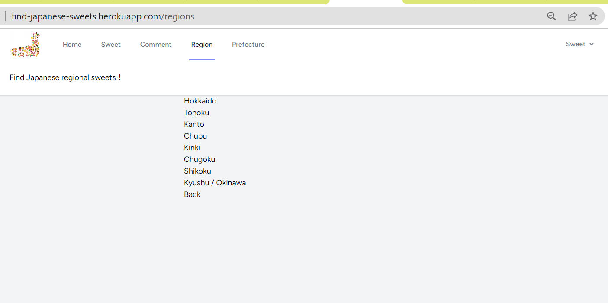
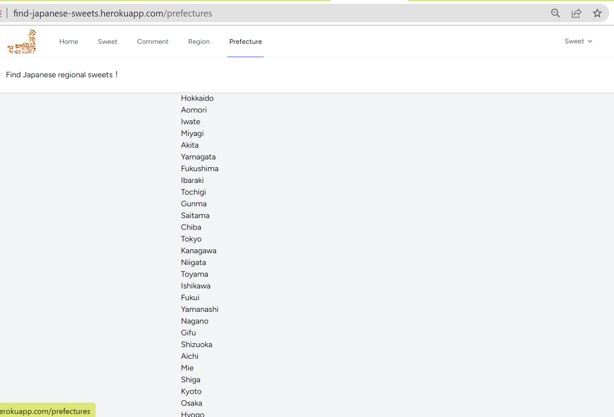
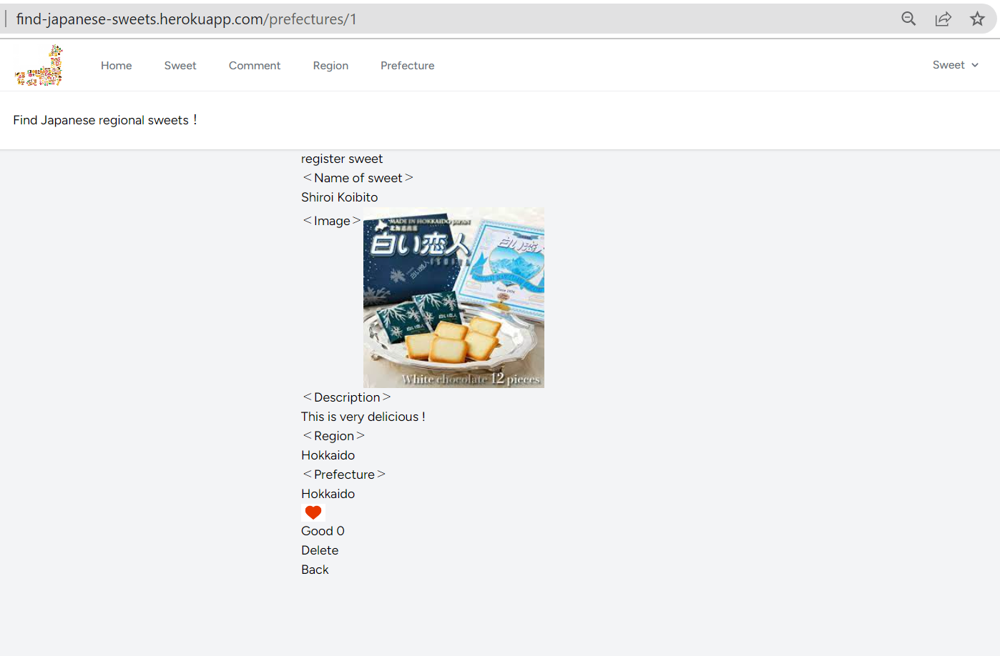

## 利用方法
### お菓子を検索したいユーザー：
お菓子を検索したいユーザーは、ランキングが表示されたHomeページやSweetページ（お菓子の一覧ページ）上のお菓子の名前を選択することで、そのお菓子の簡単な説明と、お菓子に関する書き込みが全て見ることができるページにたどり着きます。また、特定の地域や都道府県に関連するお菓子を探したい場合は、ヘッダーの「Region」「Prefecture」にいき、そこでお菓子を探したい地域や都道府県を選択すると、各地域や都道府県に関連するお菓子の一覧が表示され、お菓子を探すことができます。なお、各お菓子記事内の地域名や都道府県を選択することによっても、同様のお菓子一覧ページが表示されます。

### 新しくおすすめのお菓子を投稿するユーザー：
新しくおすすめのお菓子を投稿するユーザーは，HomeページやSweetページ（お菓子の一覧ページ）の上部にある「register」からお菓子投稿を行うことができます。お菓子の投稿では、「お菓子の名前」「お菓子についての説明」「お菓子の画像」「地域」「都道府県」を記入、アップロードします。なお、画像はアップロードしなくても投稿できます。また、投稿を編集・削除することも可能です。

### 食べたお菓子についての感想等を共有したいユーザー：
食べたお菓子についての感想等を共有したいユーザーは、Commentページ（コメント一覧ページ）の上部にある「Let's Comment!」から「お菓子の名前」「お菓子の画像」「コメント内容」を記入・アップロードし、コメントを登録することができます。なお、画像はアップロードしなくても登録できます。また、コメントは削除することが可能です。

## 今後の計画
・選択する場所がわかりやすいようにリンクをボタン表示にする、地域名、都道府県名の横に適切な画像を添付するなど、視覚的にわかりやすくしてUIを洗練していく。　 
・投稿者以外の投稿内容の編集、更新、削除の制限機能の実装　 
・ログインユーザー自身の投稿表示ページの作成　 
・お菓子検索機能の実装　 
・地域や都道府県ごとのランキング機能の実装　 
・同じお菓子名の登録制限機能の実装　 
・投稿日時表示機能の実装　 
・投稿者名表示機能の実装　 
